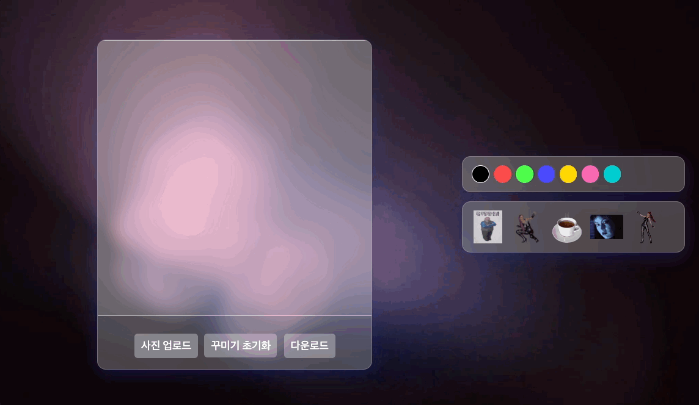

# 🎨 DecoPic - 스티커 사진 꾸미기



사진을 꾸미고 스티커를 붙여서 나만의 이미지를 만들 수 있는  
**스티커 사진기 웹 앱**입니다.

## 배포 링크

[🎨 DecoPic - 스티커 사진 꾸미기](https://dev-oil.github.io/project-decopic/)

- GitHub Pages를 통해 정적 웹으로 배포

## 주요 기능

- 사진 업로드
- 자유롭게 그림 그리기 (색상 선택)
- 드래그 앤 드롭으로 스티커 붙이기
- 그림 초기화
- 완성된 이미지 PNG로 다운로드


---

## 사용법

1. **사진 업로드** 버튼으로 꾸밀 사진을 업로드 하세요.
2. 좌측 캔버스에서 자유롭게 그림을 그릴 수 있어요.
3. 우측에서 스티커를 선택해 드래그 앤 드롭으로 붙여보세요.
4. **꾸미기 초기화**로 그린 그림과 붙인 스티커들을 리셋할 수 있어요.
5. 완성된 이미지를 **다운로드** 버튼으로 저장해보세요!

---

## 프로젝트 구조

```
decopic/
├── public/                           # 정적 파일 (그대로 복사됨)
│   ├── video/
│   │   └── background.mp4           # 배경 영상
│   └── image/
│       ├── sticker1.png             # 스티커 이미지들
│       ├── sticker2.png
│       └── ...
│
├── src/
│   ├── components/                  # UI 컴포넌트
│   │   ├── CanvasEditor.tsx         # 캔버스 그리기, 드로잉, 드롭 기능 포함
│   │   ├── UploadButton.tsx         # 이미지 업로드 버튼
│   │   ├── ToolPanel.tsx            # 색상 선택 + 펜/지우개 토글
│   │   └── StickerPanel.tsx         # 스티커 목록 패널 (드래그 앤 드롭)
│   │
│   ├── pages/
│   │   └── HomePage.tsx             # 전체 레이아웃과 상태 관리 (strokeColor 등)
│   │
│   ├── App.tsx                      # 루트 컴포넌트
│   ├── main.tsx                     # 진입점
│   └── index.css                    # TailwindCSS import
│
├── .gitignore
├── index.html                       # Vite HTML entry
├── package.json
├── README.md
├── tsconfig.json
└── vite.config.ts                   # base 설정 포함
```

## 기능 구현

### 캔버스 에디터

- HTML5 `<canvas>` 요소를 사용하여 그림판 기능 구현
- React의 `useRef`를 이용해 `<canvas>` DOM에 직접 접근하고, `useEffect`로 이미지 렌더링 및 마우스 이벤트(드로잉) 등록해 동작 제어
- 선의 색상은 상태로 관리, 선택한 색상이 실시간으로 반영되도록 작업

### 이미지 업로드

- `<input type="file" />` 요소를 활용하여 사용자의 이미지를 업로드 받았고, 업로드된 이미지 파일은 `FileReader.readAsDataURL()`을 통해 base64 형식으로 변환하여 `<canvas>`에 렌더링
- 서버 없이 로컬 파일을 브라우저에서 즉시 다룰 수 있기 때문에 해당 방법 채택

### 이미지 다운로드

- 꾸민 이미지는 `canvas.toDataURL()`를 이용해 PNG base64 형식으로 변환 후, `<a>` 태그로 다운로드 링크를 만들어 저장할 수 있도록 작업함
